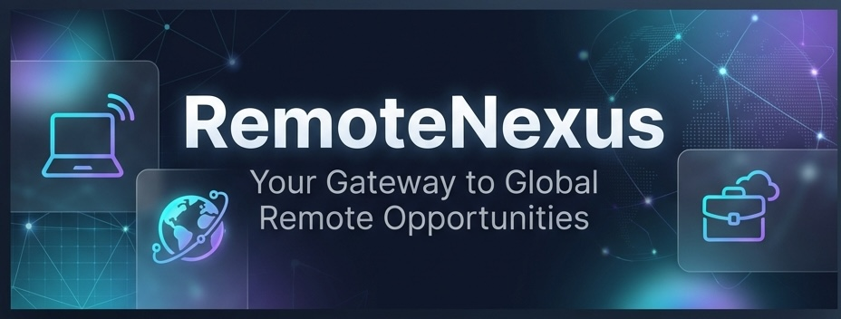

# 🚀 RemoteNexus

<div align="center">
  


**Your gateway to global remote opportunities**

### 🌐 [Visit RemoteNexus →](https://remotenexus.pages.dev/)

[](https://opensource.org/licenses/MIT)
[](https://reactjs.org/)
[](https://www.typescriptlang.org/)
[](https://vitejs.dev/)

[Features](#-features) • [Getting Started](#-getting-started) • [Tech Stack](#-tech-stack)

</div>

---

## 📖 About

**RemoteNexus** is a premium job portal designed to connect talented professionals with high-quality remote work opportunities worldwide. Built with modern web technologies, it offers a sleek, fast, and intuitive experience for job seekers looking to find their next remote role.

### Why RemoteNexus?

- 🌍 **Global Opportunities** - Access thousands of verified remote jobs from around the world
- ⚡ **Lightning Fast** - Built with Vite and React for instant page loads
- 🎨 **Beautiful UI** - Modern, glassmorphic design with smooth animations
- 💾 **Save & Track** - Bookmark your favorite jobs and track applications
- 🔍 **Smart Filters** - Find exactly what you're looking for with powerful search and filtering
- 📱 **Fully Responsive** - Perfect experience on desktop, tablet, and mobile

---

## ✨ Features

### 🔥 Core Features

- **Job Listings** - Browse curated remote jobs from RemoteOK
- **Advanced Search** - Filter by keywords, tags, location, and salary
- **Job Details** - Comprehensive job descriptions with company information
- **Save Jobs** - Bookmark positions to review later
- **Similar Jobs** - Discover related opportunities based on skills and tags
- **Responsive Design** - Seamless experience across all devices

### 🎯 User Experience

- **Dark Mode UI** - Easy on the eyes with a modern dark theme
- **Glassmorphism** - Beautiful frosted glass effects throughout
- **Smooth Animations** - Polished micro-interactions and transitions
- **Fast Navigation** - Client-side routing with React Router
- **Persistent State** - Your saved jobs are stored locally

---

## 🚀 Getting Started

### Prerequisites

Before you begin, ensure you have the following installed:
- **Node.js** (v18 or higher)
- **npm** or **yarn**

### Installation

1. **Clone the repository**
   ```bash
   git clone https://github.com/yourusername/remotenexus.git
   cd remotenexus
   ```

2. **Install dependencies**
   ```bash
   npm install
   ```

3. **Start the development server**
   ```bash
   npm run dev
   ```

4. **Open your browser**
   
   Navigate to `http://localhost:3000` to see the app in action!

### Build for Production

```bash
npm run build
```

The optimized production build will be in the `dist` folder.

### Preview Production Build

```bash
npm run preview
```

---

## 🛠 Tech Stack

### Frontend
- **React 19.2** - Modern UI library with latest features
- **TypeScript 5.8** - Type-safe development
- **React Router 7.9** - Client-side routing
- **Vite 6.2** - Next-generation build tool

### Styling
- **Vanilla CSS** - Custom styles with CSS variables
- **Glassmorphism** - Modern frosted glass design
- **Responsive Design** - Mobile-first approach

### Data Source
- **RemoteOK API** - Curated remote job listings
- **Local Storage** - Persistent user preferences

---

## 📁 Project Structure

```
remotenexus/
├── components/          # Reusable UI components
│   ├── AIModal.tsx
│   ├── Footer.tsx
│   ├── Header.tsx
│   ├── Icons.tsx
│   ├── JobCard.tsx
│   └── JobFilters.tsx
├── context/            # React Context for state management
│   └── Store.tsx
├── pages/              # Page components
│   ├── About.tsx
│   ├── Home.tsx
│   ├── JobDetail.tsx
│   ├── NotFound.tsx
│   ├── Privacy.tsx
│   └── Saved.tsx
├── services/           # API and business logic
│   └── jobService.ts
├── public/             # Static assets
│   └── founder.png
├── App.tsx             # Main app component
├── constants.ts        # App constants and configuration
├── types.ts            # TypeScript type definitions
├── index.tsx           # Entry point
└── index.html          # HTML template
```

---

## 🎨 Design Philosophy

RemoteNexus follows modern web design principles:

- **Minimalism** - Clean, uncluttered interface
- **Consistency** - Uniform design language throughout
- **Accessibility** - Semantic HTML and keyboard navigation
- **Performance** - Optimized for speed and efficiency
- **Responsiveness** - Fluid layouts that adapt to any screen

---

## 🤝 Contributing

Contributions are welcome! Here's how you can help:

1. Fork the repository
2. Create a feature branch (`git checkout -b feature/amazing-feature`)
3. Commit your changes (`git commit -m 'Add amazing feature'`)
4. Push to the branch (`git push origin feature/amazing-feature`)
5. Open a Pull Request

---

## 📄 License

This project is licensed under the **MIT License** - see the [LICENSE](LICENSE) file for details.

---

## 👨‍💻 About the Founder

<div align="center">

**Bhanu Pratap Saini**  
*Founder & Developer*

Building tools to empower the remote work revolution 🚀

[](https://www.linkedin.com/in/bhanu-saini-3bb251391/)
[](https://github.com/bhanu2006-24)
[](https://instagram.com/krishna_websites)

</div>

---

## 🙏 Acknowledgments

- Job data powered by [RemoteOK](https://remoteok.com/)
- Built with modern web technologies and best practices
- Designed for the global remote work community

---

<div align="center">

### ⭐ Star this repo if you find it useful!

**RemoteNexus** • Connecting talent with opportunity

</div>

</div>
